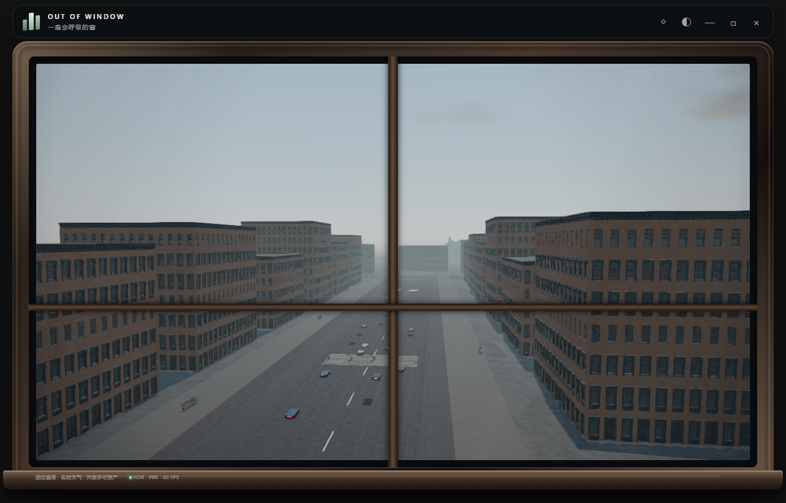
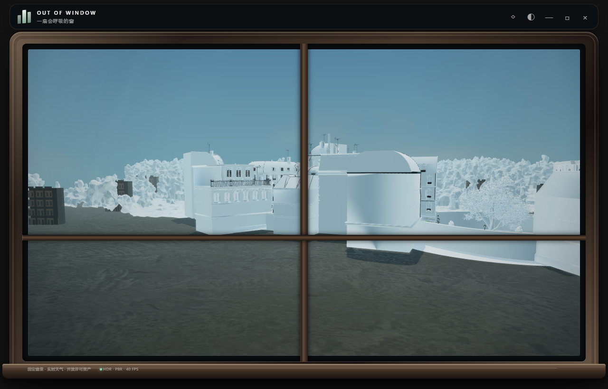
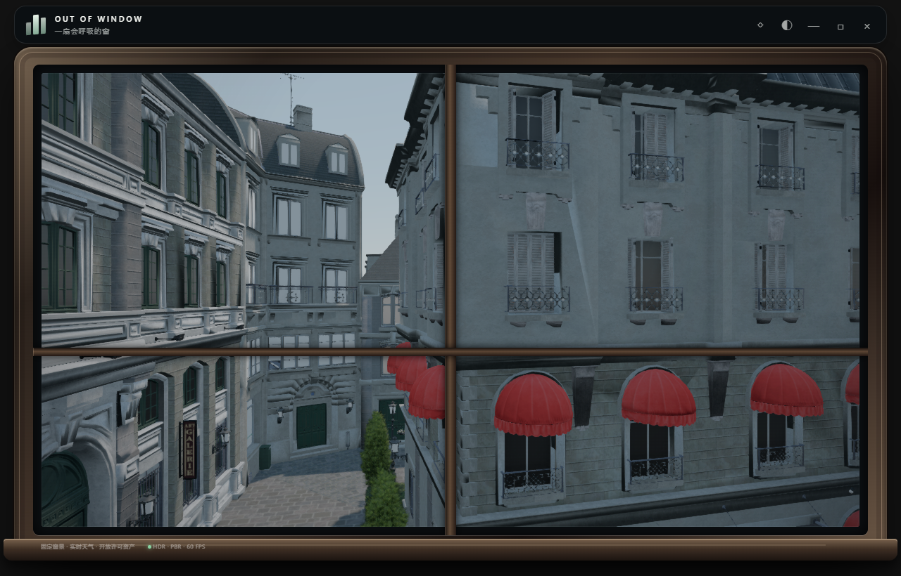
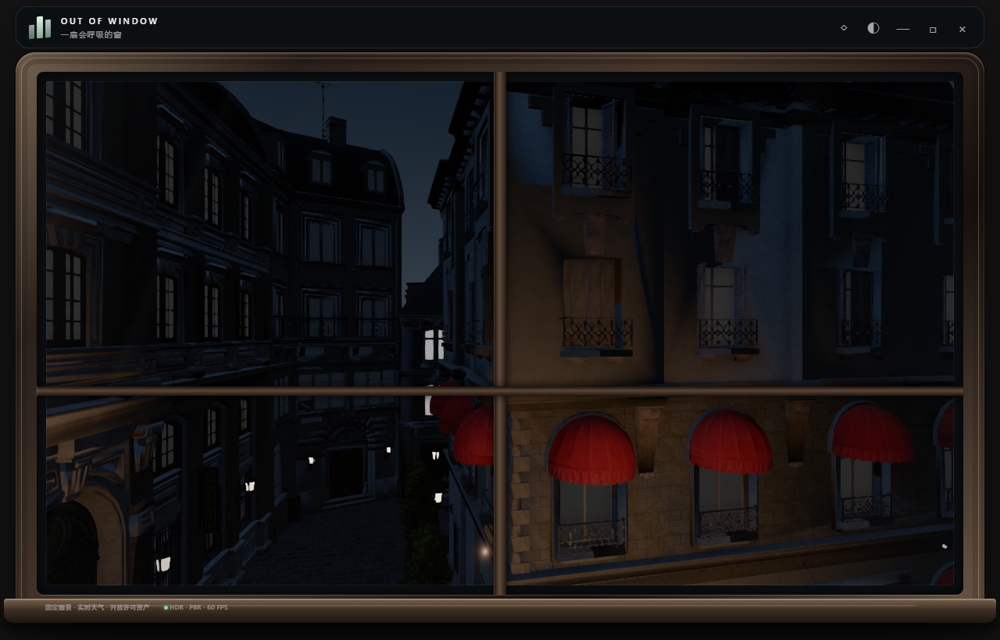
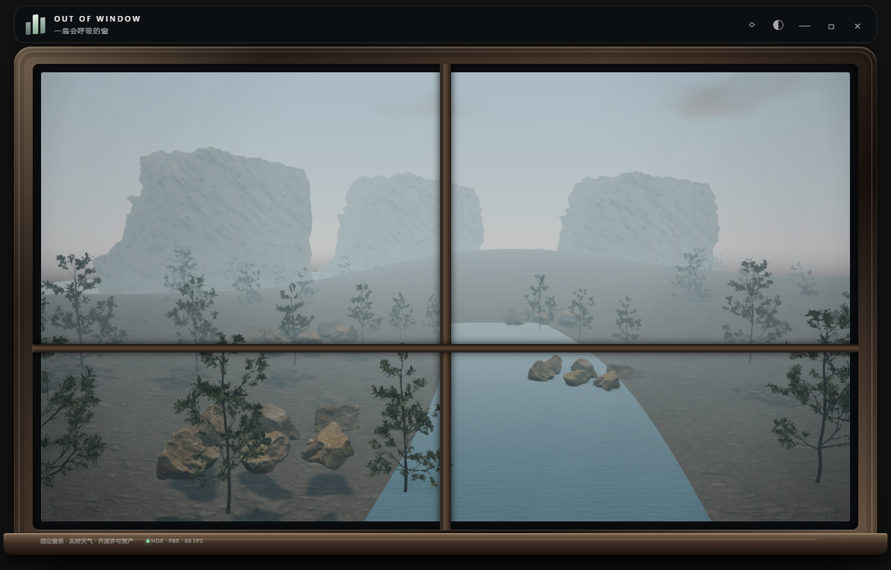
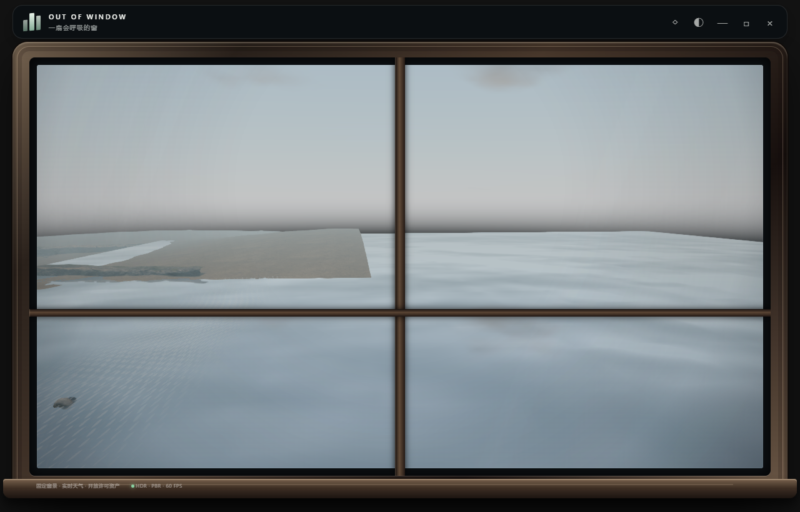

# 窗景写实渲染研究与首轮改进

研究日期：2026-09-08。对象：本仓库 Electron + Three.js 0.179.1 实现。结论来自源码、GLB 材质检查、实际 GPU 离屏截图和下文官方资料。

## 2026-09-09 更新：都市与后巷独立

按本轮确定的方向，将原城市场景拆成两个独立的模型组、资产清单和相机配置。后巷保留当前 Bistro 机位 `(-20,23,-208) → (-46,23,-246)`、55° 视场角；都市使用此前街内机位看不到的 Poly Haven 公寓、工业立面和 Helsinki 远景，相机为 `(10,26,34) → (-4,19,-110)`、50° 视场角。此前 P0 中的机位冲突由两个场景各自构图解决。

都市按模型实际的 3×3 m 网格拼装四面公寓与屋顶，修复立面空隙、道路背面朝上及工业外壳遮挡立面的问题；重复建筑模块实例化，部分玻璃提供夜间发光。标线改为受光材质，避免夜晚自行发白。后巷保留原街内视角与路灯。它们沿用已修好的线性 HDR、天空、PMREM、阴影刷新及贴图加载管线。

首次启动只加载都市所需的四份模型，Bistro 在选择后巷时加载；共享座椅只解码一次。重复切换复用模型，时间、天气和画质保持不变。界面现在有五个场景，都市与后巷使用实际渲染截图作为预览。

本轮验证：两个场景的昼夜、雨雪雾组合均无加载或着色器错误；18 项功能回归通过，涵盖场景归属、延迟加载、原机位保留、重复切换、设置保持，以及此前 P0 的环境捕获和阴影检查。1280×820、均衡画质、离屏 60 Hz 上限下，所测组合的中位帧间隔约 16.7 ms。首次拼装的约 50 ms 降至此水平，但拼装和绘制方式均有变化，不能当作单纯的算法性能对比。都市仍提交约 1,180 万三角形/帧，实例化减少提交开销，并未实现几何 LOD；常驻桌面功耗仍需单独评估。

`npm run build` 和实际本地构建版五个场景按钮的资源加载检查通过；截图覆盖 1040×690 与 760×510 窗口。数据与截图见 [拆分回归记录](docs/urban-scene-split/evidence.json)。下文 2026-09-08 的“城市”性能表和截图保留为历史记录，其中街内视图现在对应“后巷”。

拆分解决了资产与机位的冲突，画质仍需要继续提升：都市的立面重复、道路和示意车辆、局部反射及远景烘焙光照尚需美术处理；后巷的几何简化和原始 ORM 通道恢复仍是下一阶段重点。

## 结论与推荐方向

优先把**固定机位下的可见范围做成可重新打光的完整写实场景**。都市与后巷分开组织后，各自按此标准完善。当前瓶颈同时存在于资源加载、场景布置、材质转换和照明，增加模型面数或更换引擎都无法单独解决。

建议继续使用现有 Electron/Three.js 完成城市样板间：先修复基础管线，再重整近景资产和局部间接光。以这一机位的参考图、实测帧时间和显存占用决定是否升级 WebGPU 或另做 Unreal 原型。本轮已落实基础修正；**尚未达到超写实画质**，自然场景尤其需要重新布景。

## 实际发现

| 优先级 | 仓库证据 | 对画面的影响 | 本轮结果 |
|---|---|---|---|
| P0 | `index.html` 的 `connect-src`、`img-src` 没有允许 `blob:`；首次运行记录 663 条相关加载错误 | GLB 内嵌贴图无法加载，主街景和 Helsinki 大片白模 | 仅为图像和资源读取补充 `blob:`，脚本权限保持原样；开发及本地构建版零加载错误 |
| P0 | 原始相机 `(0,31,-35)` 看向街区后方；模型实际范围约 `179×190×52.6` | 背墙、大面积空地占据画面，资产的精细正面几乎没有发挥作用 | 通过俯视图和路面射线定位，改为街内固定机位；相机路面高度约 16 m |
| P0 | 天空颜色手工渐变，自定义 shader 缺少输出颜色转换 | 天空和 PBR 建筑不在一致的显示转换下，调曝光难以校正 | 解析天空、线性 HDR 中间缓冲、统一 OutputPass 和 AgX |
| P0 | PMREM 与同一天空生成的 LightProbe 同时启用 | PBR 漫反射重复获得天空能量，阴影发灰 | 以 PMREM 作为主要环境漫反射与镜面反射来源 |
| P0 | 捕获天空前隐藏所有模型，但可能消耗 `shadowMap.needsUpdate` | 环境更新可能把待刷新的阴影绘成空图 | 捕获期间保护并恢复阴影刷新状态 |
| P0 | 每次 PMREM 仅保存、释放 `.texture`，未保存整个 RenderTarget | 长期开启应用时，资源生命周期不完整 | 持有并释放完整目标；连续六次捕获检查纹理数量稳定 |
| P1 | 主窗玻璃全屏 `transmission=.96` | 为几乎不可察觉的折射额外绘制重型场景 | 改为薄弱反光，取消整屏透射；真实水面的独立效果保留 |
| P1 | Bistro 玻璃粗糙度约 `.92–.99`；部分金属 `metalness=0`；微型铁艺的 `map` 被置空 | 玻璃像粉刷墙，铁艺镂空变成实体挡板 | 语义材质参数修正、保留 alpha cutout、石板路雨天响应 |
| P1 | 天气粒子仍围绕世界原点；城市位于 `z≈-200` | 城市雨雪模式缺乏窗外降水；风使粒子长期漂出范围 | 粒子跟随当前机位并循环横向位置；实时天气使用传入天气码 |
| P1 | 日落后仍将太阳抬到地平线上方，并保留最小强度 | 夜间光源方向不可信 | 夜间关闭太阳，增加近处实际路灯位置的局部光和低强度城市夜空补光 |
| P1 | 当前 GLB 只完整保留 BaseColor/Normal，未恢复原始 ORM；贴图统一压至 512 px | 石材、油漆和金属缺少微观差异，近景经不起观察 | 本轮仅校正参数；资产通道重建仍待完成 |

Three.js 的官方说明要求线性工作空间与最终输出转换一致，自定义 shader 需处理颜色转换，使用后处理时需 OutputPass。本轮按此修正，避免通过不断提高亮度掩盖管线错误。[颜色管理说明](https://threejs.org/manual/en/color-management.html)

## 已实现的渲染结构

`PBR 场景 → Half-float HDR/深度 → GTAO + 去噪 → AgX/输出色彩转换 → FXAA → 窗框 UI`

- **天空**：使用 Three.js 的 Rayleigh/Mie 解析模型，由真实太阳方向驱动；云层使用二维密度和光学厚度近似。当前不是体积云，夜空补光也不是月相模型。[Sky 官方实现说明](https://threejs.org/docs/pages/Sky.html)
- **接触阴影**：GTAO 从主渲染深度重建几何法线，不再用覆盖材质重复绘制整个街区，也避免透明树叶在额外深度通道里变成矩形。它改善局部遮挡，不能产生反弹光或补足画外信息。官方也说明 GTAO 的质量和成本都高于 SSAO，因此提供画质档。[GTAOPass](https://threejs.org/docs/pages/GTAOPass.html)
- **环境反射**：128 像素立方天空捕获；捕获排除太阳圆盘，直射太阳由 DirectionalLight 提供。PMREM 不包含周围建筑，局部玻璃反射仍需下一阶段补充。
- **材质**：玻璃、裸露金属、织物采用分类参数估计；恢复铁艺镂空；现有灯具产生夜间发光，最近四处可识别路灯提供局部点光。点光未开启阴影，不能视为全局照明。
- **质量档**：节能关闭 GTAO、像素倍率上限 1；均衡使用 0.65 分辨率 GTAO、倍率上限 1.25；精细使用全分辨率 GTAO、倍率上限 1.65。倍率受实际屏幕 DPR 限制。这些档位目前不限制 FPS。

## 画面对照与验证

原始运行画面：

首轮修正后：

夜间：

测试条件：1280×820 Electron 离屏窗口，60 Hz 上限，上海坐标，2026-09-08，固定时间与天气，禁用外部定位/天气请求；资产载入及环境捕获完成后采集 90 个动画帧间隔。**这些是离屏帧间隔，不是 GPU timestamp，也不是持续桌面功耗测试。**

| 检查 | 结果 |
|---|---|
| 原始城市 | 663 条加载错误；只有 38 个材质有法线贴图 |
| 仅修复贴图、保留原机位 | 零加载错误；126 个材质有法线贴图；中位帧间隔约 33.3 ms |
| 首轮完整修正、街内新机位 | 零加载/着色器错误；133 个材质有法线贴图；城市晴/雨/雪/雾/日落的中位帧间隔约 16.7 ms |
| 几何提交 | 原机位约 5,096 次 draw、523 万三角形/帧；新机位约 697 次 draw、103 万三角形/帧 |
| 功能检查 | 夜间太阳、实时天气码、阴影刷新保护、六次环境捕获资源稳定、三档切换、AO 不重画几何、手动时间下跨场景光照原点更新，11 项通过 |
| 场景回归 | 城市、山林、村庄、海滨均完成资产载入及渲染检查，无着色器错误 |
| 打包检查 | `npm run build` 通过；实际 `file://` 构建版全部城市资产载入，控制台零错误 |

构图、可见物体数量和渲染链同时改变，因此上述性能差异**不能归因于某一个算法，也不是相同构图的速度对比**。无贴图的白模运行较快也没有产品比较意义。构建仍提示主 JS 包超过 500 kB，资源分包属于后续工作。

运行方法见 README；原始数据与详细截图在 `.runtime/render-audit/`，归档摘要见 [evidence.json](docs/rendering-review/evidence.json)。

## 距离超写实还缺什么

### 1. 重整一个固定视角的资产，而不是继续扩充场景数量

城市近景仍能看到檐口、窗框和墙面简化损伤，部分曲面与薄片几何不自然；512 px 纹理缺少近景细节。原始转换脚本 `scripts/prepare_bistro.mjs` 只提取 BaseColor 和 Normal。换成 `MeshPhysicalMaterial` 不会补回丢失的数据。

建议先为当前机位制作完整的 DCC 场景包：

1. 用门高、层高、路灯高度校准米制尺度；固定相机、窗户朝向及太阳世界坐标约定。
2. 近景保留原始高质量窗框、铁艺和檐口，对低屏幕占比部分单独简化；按屏幕误差制作 LOD，保护 UV 接缝、alpha 面片和法线硬边。
3. 恢复真正的 Roughness/Metalness/AO 通道，核验 OpenGL 法线方向；不要把照片明暗直接当粗糙度，也不要把烘焙阴影当表面颜色。
4. 按可见像素分配纹理：近景关键立面尝试 2K，近中景 1K，远景 512/更低；用真实尺寸的纹理密度校准，避免全部无差别升至 4K。
5. 完成街面连续性、建筑背面、街角和远景遮挡；现有示意车流和手工道路需要按真实街道重新定位、换成合适资产。

优先投入在连续街景、材质完整性和构图。摄影测量远景包含采集时光照，应限制在远处，并完成去光照与颜色统一。

### 2. 间接光和局部反射

现在的天空 IBL 加 GTAO 仍不能表现墙面反弹光、屋檐下受环境遮挡的天光，以及玻璃里周围建筑的倒影。Filament 对 IBL、遮挡和物理材质的讨论可作为校准参考；其核心是材质与光照分离，而不是一组固定的漂亮颜色。[Filament PBR 文档](https://google.github.io/filament/main/filament.html)

建议对固定场景先验证**可重照明的预计算传输/局部探针**：预计算几何可见性与天空方向响应，运行时按天空与太阳更新。局部探针应替代对应环境贡献，避免重新重复加光。玻璃采用局部立方探针及空间校正；湿路面只对选定区域评估平面反射或 SSR。

若局部光变化和动态物体较多，再评估 WebGPU 下的动态探针 GI。用同一场景的离线路径追踪结果校准暗部、材质和高光，实时桌面默认不承担持续路径追踪成本。

### 3. 天气需要改变整个场景

目前仍缺：由遮蔽关系决定的湿润/干燥过程、积水遮罩、随表面朝向和积累量变化的积雪、玻璃雨滴、云影、真正的体积雾与分层风。

实现顺序建议为：湿润度状态与积水遮罩 → 日照/云影一致性 → 玻璃雨滴 → 地形高度雾 → 低分辨率体积云及时间重投影。晴雨切换应缓变，而不是同时瞬间改几十个材质。先解决天气因果关系，再增加粒子数量。

### 4. 自然场景需要重新布景

山林仍有孤立的扫描块、稀疏树木和缺乏河岸的带状水面；海滨仍能看到平面边界、扫描地形的摆放缺口。此次只是验证它们没有因新管线产生加载或 shader 回归，**不代表视觉验收通过**。

不建议通过加浓雾隐藏这些问题。先在 DCC 中做连续地形与岸线、按植物群落布置实例化植被，再接入风摆、季节和天气。

### 5. 常驻桌面的性能预算

优先减少材质切换和几何提交：分块合并静态同材质网格、重复物体实例化、相机不可见内容离线裁剪、按需加载不同场景。纹理改用 KTX2，既控制下载体积，也让纹理在 GPU 上保持压缩；JPEG/PNG 体积小不代表显存小。[Khronos KTX 说明](https://www.khronos.org/ktx/)

建议验收目标（不是本轮已验证的保证）：目标笔记本 1080p 均衡档 P95 ≤ 22 ms；桌面常驻默认 30 FPS、前台交互 60 FPS；不可见/锁屏暂停或降至极低更新频率；记录 30 分钟显存和功耗趋势。应同时覆盖集显、独显、DPR 1/1.5/2、缩放和多显示器。

## 引擎选型

| 路线 | 适用条件 | 主要代价 | 建议 |
|---|---|---|---|
| 继续 Three.js/WebGL2 | 固定窗景、桌面轻量、复用现有架构 | GI、体积效果需要精心选择；资产生产仍占主要工作量 | 当前优先，先做一个合格样板间 |
| Three.js/WebGPU | 需要计算着色器、更复杂的动态 GI/云和植被处理 | 现有 Water、Sky、后处理和自定义 GLSL 需逐项迁移验证 | 在资产与性能基线稳定后建立独立原型 |
| Unreal 原生渲染 | 高端独显目标，优先更完整的动态 GI/反射和内容制作流程 | 桌面嵌入、包体、显存、启动和常驻功耗需要重新衡量 | 用同一机位做限时技术验证，不立即重写整个应用 |
| 预渲染视频/背景图 | 只需固定时间段、有限天气组合 | 难以与任意太阳方位、实时天气保持一致 | 可用于参考图或独立轻量模式，不宜替代主要动态世界 |

Unreal 的 Lumen 本身也需要明确性能预算：官方给出的主机目标在 1080p 下约为 4/8 ms 的 GI、反射及体积雾预算。它是评估成本的参考，不是本应用换引擎后自动达到写实或低功耗的保证。[Lumen 性能指南](https://dev.epicgames.com/documentation/unreal-engine/lumen-performance-guide-for-unreal-engine?lang=en-US)

## 建议下一轮交付

完成当前城市机位的一个正式场景包：保真几何、2K/1K KTX2、完整材质通道、局部间接光与玻璃反射、湿润度遮罩、对齐的车流。以同机位的晴天正午、阴天、日落、雨后和夜间五张离线参考图为目标，逐项对照实时结果。只有它通过画质和 30 分钟常驻性能验收后，再把资产规范和渲染配置推广到其余三种场景。
