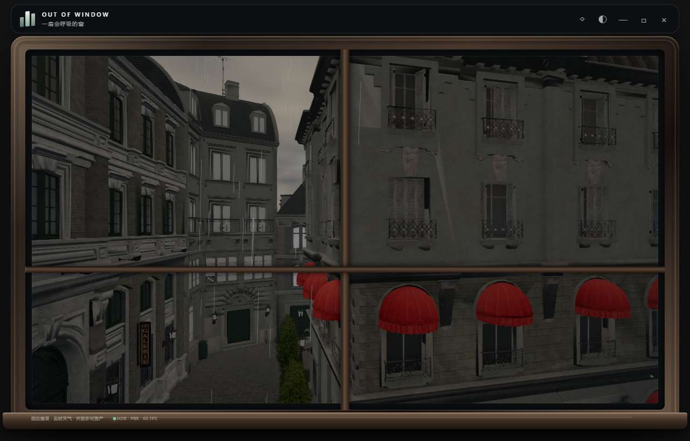
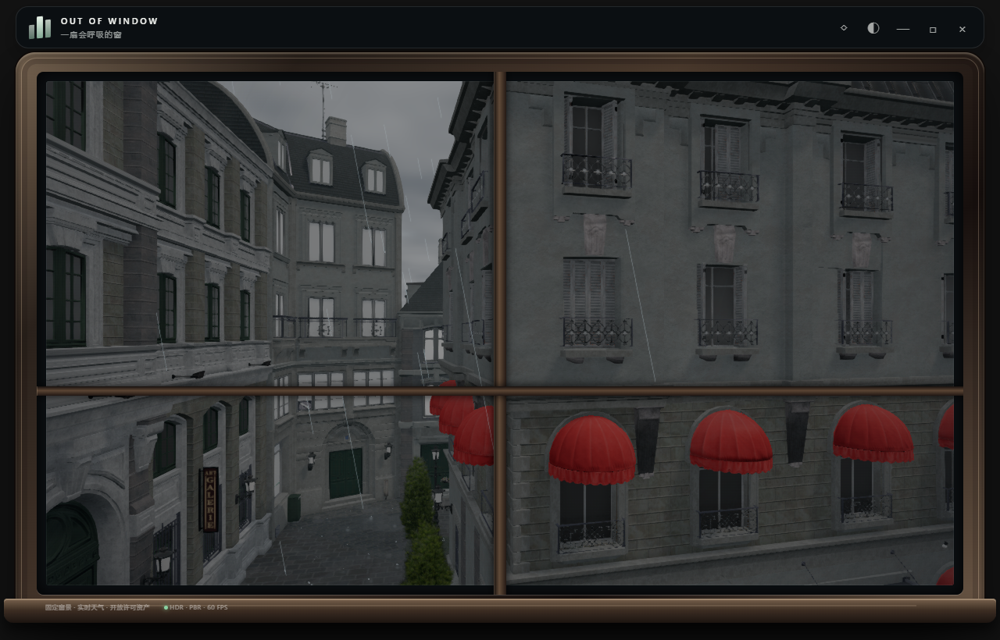
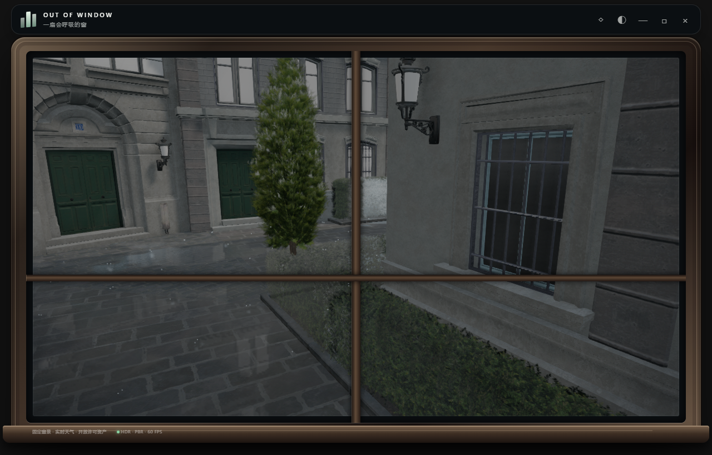

# 日照、墙面与风雨响应修正

2026-09-09，针对新加坡 10:47 后巷截图的反馈。后巷机位保持不变。

以下为首轮记录。随后发现默认画面中的酒店窗蓬未匹配动画规则，粒子预算也漏掉了部分近处地面；第二轮已修正，并按 2D 写实参考加强干湿与积水层次。最新画面、参数和验证以 [第二轮对照记录](docs/alley-photoreal/COMPARISON.md) 为准。

## 已修正的行为

- **时间与天光**：原“清晨”标签来自 `hour < 11` 的硬编码，并非太阳高度停在清晨。复算新加坡 2026-09-09 10:47 的太阳高度约 56.0°、方位角约 81.8°。现在显示“上午”，晨昏标签同时参考太阳高度；日序使用所在地日期，处理闰年、夏令时和 UTC 跨日。太阳方向统一为北向 −Z、东向 +X。阴雨云层使用中性日光，避免上午出现暖色暮光感。[NOAA 计算公式](https://gml.noaa.gov/grad/solcalc/solareqns.PDF)
- **墙面矩形色块**：射线检查发现部分平墙的顶点法线与实际三角面方向不一致；关闭阴影和法线贴图的对照不能代替几何法线修复。对 306 个砖石墙面网格按 35° 折角重建法线，保留 UV 和硬边；删除失配的旧切线，保留原有法线贴图。窗框、金属、窗蓬及植物不使用这项墙面修复。[Three.js 法线与材质说明](https://threejs.org/docs/pages/MeshStandardMaterial.html)
- **湿润与积水**：地表按世界坐标遮罩逐渐变暗、降低粗糙度；较湿区域形成不均匀积水，水面法线逐渐平缓，并叠加雨滴涟漪。停止降雨后保留湿地和积水，逐渐排水、干燥。反射捕获附近建筑，均衡档最多约 5.6 次/秒，精细档最多 10 次/秒；节能档保留天空反射与湿润，关闭额外建筑反射捕获。
- **遮雨与水花**：都市和后巷根据向下射线生成地表、遮挡高度场。雨丝在屋顶或地面处裁切，水花只生成在采样确认的露天地面，272 个后巷落点和 1,275 个都市落点参与分布。地面水花是短促上抛后回落的粒子，积水涟漪随雨强变化。
- **窗蓬和植物**：后巷 8 个布料网格、100 个植物网格增加风和落雨冲击变形。窗蓬上缘、植物底部固定；不同部位采用不同振幅和相位，影子采用同样的变形。雨丝、云层与运动使用同一风向，接入风速、风向、阵风字段。[Open-Meteo 数据字段](https://open-meteo.com/en/docs)

## 实际画面

原阴雨画面：

同一后巷机位，修正后：

积水与水花近景（仅用于检查地面，产品机位未改变）：

[后巷风雨录像](docs/weather-response/alley-rain.webm) · [地面水花与涟漪录像](docs/weather-response/ground-rain.webm)

## 验证与范围

- `npm run test:weather`：6 项通过，包括新加坡上午日照、跨日/闰年、夏令时、晨昏标签、湿润积累/干燥、风向及单位换算。
- GPU 渲染：原有 18 项回归和新增 13 项天气回归通过；包括可见墙面法线、固定/活动顶点、遮雨区域、反射目标复用、阴影状态保护、节能档与干燥过程。
- 晴、雨、夜间、雪天及地面近景无加载、着色器或 GPU 反馈回路错误。1280×820、均衡档、Electron 离屏 60 Hz 上限下，所测组合中位帧间隔约 16.7 ms；不等同于 GPU 耗时或持续桌面功耗测量。
- 截图使用固定新加坡日期、坐标与时间；雨天预先推进湿润状态 60 秒便于对照，实际运行会逐渐湿润。

这是一套实时近似：遮挡场为 32×40 采样，窄檐与植被细缝并非逐滴精确求交；积水由地表遮罩与水平反射平面表现，不模拟水体体积和流向；窗蓬是受约束的顶点变形，不是完整布料求解。反射仅用于接近路面高度的积水。自然场景保留既有风摆和基础地表湿润，本轮的遮雨、地面水花及局部积水反射集中在都市和后巷。

验证数据见 [evidence.json](docs/weather-response/evidence.json)。离屏渲染检查可在 `npm run dev` 运行后设置 `AUDIT_VERIFY=1`、`AUDIT_WEATHER_VERIFY=1`；案例需先加载后巷，可参考 `scripts/render-audit.cjs`。
