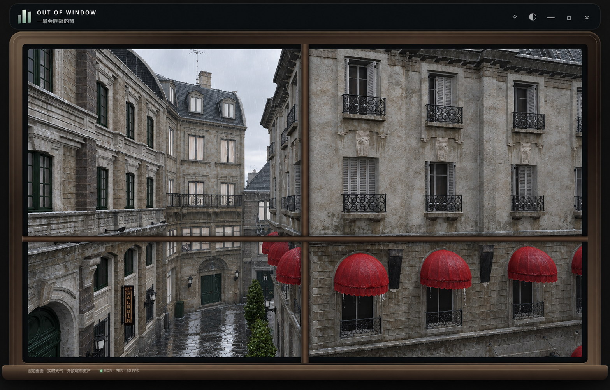
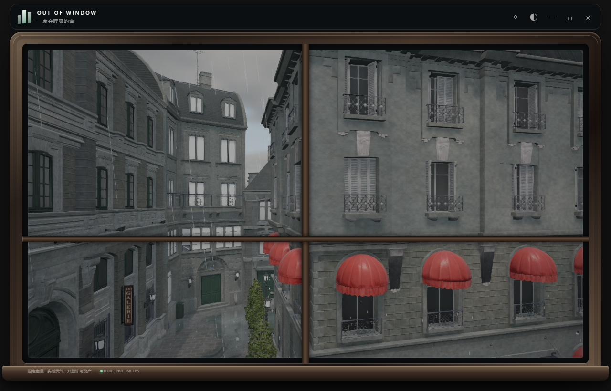
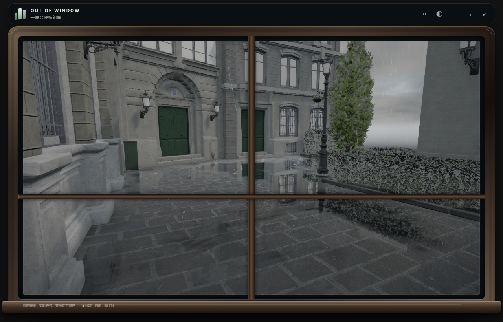

# 后巷：从 2D 写实参考到实时风雨改进

2026-09-09。以现有后巷截图生成超写实参考，再逐项检查真实 3D 网格和最终画面。**后巷相机、建筑布局未改变；生成图只用于美术对照。**

## 看到的差距与落实的改动

| 对照项 | 原画面的问题 | 本轮 3D 改动 |
| --- | --- | --- |
| 阴雨日光 | 立面整体偏暗，干湿层次弱 | 调整阴雨环境亮度和曝光，保留日照位置、晨昏变化；墙面保持较高粗糙度 |
| 石材色调 | Bistro 的中性底色被蓝色天空和填充光染成蓝灰 | 后巷单独使用暖石灰环境反弹、暖色半球光和雨天曝光补偿；墙体 shader 保留暖石灰色，不改变都市场景色彩 |
| 路面与积水 | 水面覆盖多落在树旁；石板法线和重复天空高光削弱倒影 | 扩展不规则积水覆盖、独立平缓水面法线，分离湿石与积水反射；小雨控制积水面积，浅水仍具有水面光学效果；局部建筑反射提高到 768×512；对 Bistro 地面增加雨场遮罩兜底、微表面法线和破碎天光高光 |
| 红色窗蓬 | 默认可见的 `Awnings_Hotel_Fabric` 未匹配旧动画规则 | 覆盖全部 26 个布料网格（之前仅 8 个，漏掉 18 个酒店窗蓬）；固定上缘，按实际尺寸计算风摆、边缘颤动和雨滴冲击 |
| 湿布与滴水 | 布面缺少干湿粗糙度差异、蓬边没有落水 | 湿布变暗、分区降低粗糙度，细微表面起伏打散塑料感高光；从实际蓬边顶点生成滴水 |
| 植物 | 小模型位移不足；增强高光后透明叶片出现叠加泛白 | 根据植物实际高度计算位移，保留底部约束；叶片使用透明裁切与深度写入，调整湿叶粗糙度 |
| 水花 | 粒子上限截取了地面采样的前半段，近处漏点 | 在整个可用地面上均匀分配预算；遮雨场提高到 48×64，保留水滴上抛回落与积水涟漪 |
| 近景窗框 | 全局安全减面包会让近景玻璃和边框面数偏少，局部比例容易歪斜 | 后巷用屏幕空间 LOD 按整栋建筑切换；默认机位视锥内 70m 恢复 26 组建筑高模，并在默认机位 54m 内按玻璃边界生成独立窗框条；其余远处建筑继续使用减面几何 |

反射仍按画质限频：均衡档最多约 5.6 次/秒，精细档最多 10 次/秒；节能档使用天空反射。停止降雨后地面逐渐排水、干燥。

本轮继续对照参考图收紧了两个差距：墙面增加了世界坐标投影的矿物斑驳、细颗粒和檐下垂直雨痕，并在墙体和石板上加入与 UV 密度无关的导数微法线；石板路把水面覆盖和反射亮度分离，加入破碎的阴天天光亮部，同时保留石板纹理与不连续边界。启动遮罩会等五个场景资源和共享着色器预热完成后才消失。

## 画面对照

改进前的实时 3D：

生成的 2D 参考，包含生成模型推断的纹理、细节与倒影；不能作为几何或光照的物理真值：

改进后的实时 3D，同一默认机位：

[默认机位风雨录像](alley-rain.webm) · [实时毛毛雨录像](live-drizzle.webm) · [积水与水花近景录像](ground-rain.webm)

近景仅用于检查材质、倒影和水花，产品机位保持不变：

## 验证

- `npm run test:weather`：6 项通过，覆盖太阳位置、所在地日期、夏令时、晨昏、湿润变化及风向。
- GPU：18 项原有回归、20 项天气回归通过；新增检查直接射线确认默认机位的三处红色酒店窗蓬均有变形，并检查粒子覆盖完整地面。
- 两组动画截图检查通过：隔离实际可见窗蓬和植物，冻结时间、隐藏雨丝等干扰，比较 3.0 秒与 3.8 秒的 GPU 结果。窗蓬有 1,110 个像素、植物有 3,655 个像素的颜色变化超过 12/255。这用于确认动画实际发生，不等同于位移像素数或主观写实评分。
- 晴天、雨天、雨夜、雪天、都市雨景无着色器错误。1280×820、均衡档、Electron 离屏 60 Hz 上限下，中位帧间隔约 16.7 ms；这不是 GPU 耗时或桌面功耗测量。
- 固定新加坡 2026-09-09 10:47、风速 11 km/h、阵风 18 km/h。主要截图使用手动雨景，湿润状态预先推进 60 秒；另测实时天气代码 51、降水 0.2 mm 的毛毛雨。
- `npm run build` 已通过；1040×690 构建版的五场景切换、10:47“上午”标签及雨景加载通过，760×510 紧凑窗口也完成截图检查。[构建版雨景](production-rain.png)。

[渲染与动画数据](evidence.json) · [实时毛毛雨数据](live-drizzle.json) · [最终构建版检查](production-v2.json) · [生成模式与完整提示词](reference-prompt.md)

复现：启动 `npm run dev`，设置 `AUDIT_VERIFY=1`、`AUDIT_WEATHER_VERIFY=1`，将 `AUDIT_CASES` 设为 [audit-cases.json](audit-cases.json) 的原始文本，再运行 `npm run audit:render`。

## 与参考图仍有的差距

当前运行时已从 512 px 包切换到本地 ORCA 安全版本压制的 768 px 包；原始 GLB 没有嵌入 roughness/AO 通道，因此新增了由本地颜色图保守推导的 roughness、AO 和 height/bump 通道，并在启动阶段与着色器一起预加载。可选的 Poly Haven CC0 包还会补齐 diffuse、OpenGL normal、ARM 和 displacement；下载脚本完成后页面会切换到真实通道，未下载时继续使用确定性的本地推导通道。

积水是遮罩加水平反射近似，没有水体体积、排水路径或逐滴碰撞求解；窗蓬与植物使用受约束顶点变形。静态生成图中的明亮天光倒影也不能直接照搬：真实 3D 后巷会遮住部分天空，因此保留实际建筑、门窗的倒影。
