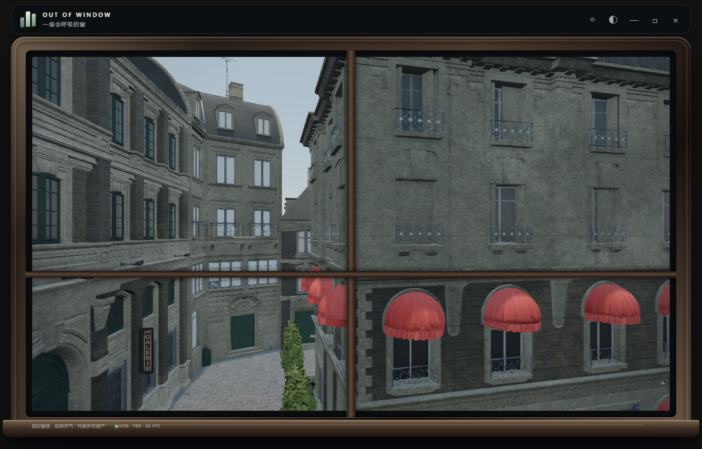
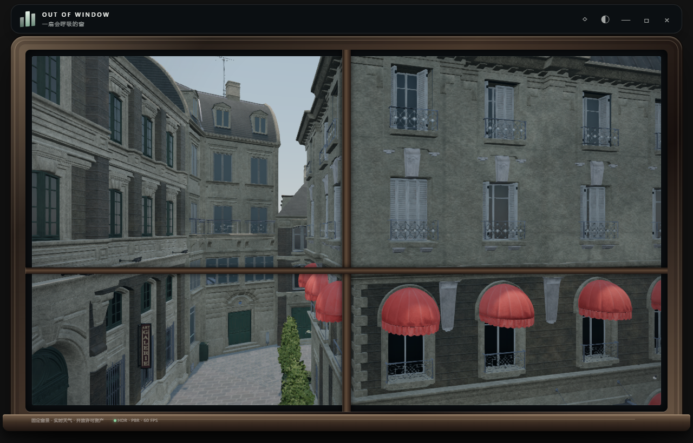

# 后巷窗户与材质修复 · 2026-09-23

浏览器复现右侧楼房中间一排窗户像被石墙封住。离线几何检查与运行时射线均命中 `paris_building_09_19`：恢复高模时，`MASTER_Details_Dark` 被兜底映射成了 `MASTER_Concrete`，使百叶窗、边框和装饰件采用了墙体纹理。原玻璃并未整体下陷；这轮保持原机位和建筑几何。

修正生成脚本，将该材质映射到包内已有的 `MASTER_Building_Details` 并重新生成 `bistro-exterior-near-768.glb`。两套源颜色和法线贴图的 SHA-256 均相同，因此复用的是原始等效材质。

左侧远处纯白的窗户来自转换后无贴图、白色、不透明的 `MASTER_Glass_Dirty`；现在用暗灰蓝底色近似背后的室内暗部，保留介质反射。建筑玻璃的遗留自发光清零，独立街灯仍按夜晚变化。这仍是低成本不透明玻璃近似，没有新增室内透射渲染。

联网核对了 [NVIDIA ORCA Bistro 原始资产说明](https://developer.nvidia.com/orca/amazon-lumberyard-bistro)、[Three.js 玻璃与反射文档](https://threejs.org/docs/pages/MeshPhysicalMaterial.html) 和下述 shader／缓存文档；未引入新的第三方贴图。

同时修正：

- 积水 Fresnel 曾把视线方向取反，使俯视和掠射角均趋于最大反射。改用 Three.js 的 `geometryViewDir`，恢复反射随观察角度变化。本地 r179 与[官方同版本光照 shader](https://github.com/mrdoob/three.js/blob/r179/src/renderers/shaders/ShaderChunk/lights_fragment_begin.glsl.js) 均使用 `normalize(vViewPosition)` 作为表面指向相机的方向。
- 砖石与灰泥生成不同 shader define，却使用同一个程序缓存键；补齐材质分支标记，避免缓存把两个表面渲染成同类。[Three.js 官方文档](https://threejs.org/docs/pages/Material.html#customProgramCacheKey) 要求缓存键区分 `onBeforeCompile` 使用的条件设置。
- 石板微法线曾复用墙面 `zy` 投影，水平面高度恒定时噪声退化成单向纹路；地面改为 `xz` 投影，保留二维细颗粒。
- 水膜透射部分曾由固定色块替代，降低反射后会丢失水下石板纹理和照明。改为按反射权重保留已受照明的石板漫反射，并去掉强制天光亮底与常量补亮；保留既有反射强度范围和轻微色调，俯视可见石板、掠射角保留倒影，暗处不凭空发亮。
- 湿叶先走了地面水膜的粗糙度分支，再二次降低粗糙度，使灌木的高频法线产生雪状白斑。叶片改为独立、单次湿润处理，湿态粗糙度下限为 .55；同机位雨景复核恢复了绿色和较宽缓的高光。

验证：`node --test scripts/solar-weather.test.mjs scripts/rain-materials.test.mjs scripts/bistro-materials.test.mjs`。覆盖源纹理等价、恢复节点材质映射、玻璃和灯具区分、shader 缓存、水下底材照明及原有天气逻辑。

## 同机位对照

窗户修正前（用于观察右楼材质误配）：

修正后，右侧百叶窗、窗框和装饰件重新可辨识，左远玻璃不再呈纯白色：

[雨天](realism-repair/rain.png) · [雨夜](realism-repair/night.png) · [积水与湿叶近景](realism-repair/ground.png)

## 验收

- 11 项 Node 自动测试通过。
- 六组离屏画面：后巷晴天、雨天、雨夜、雪天、积水近景，以及都市雨景；零渲染错误，18 项基础回归与 20 项天气回归通过。[数据](realism-repair/render.json)
- 后巷 1280×820 均衡档离屏帧间隔中位数约 16.7 ms；这是有 60 Hz 上限的采样，不能等同于 GPU 耗时或功耗。都市雨景中位数约 33.2 ms。
- 构建版五场景按钮、雨景、1040×690 和 760×510 紧凑窗口通过。[构建版记录](realism-repair/production.json)
- 最终湿叶调整另跑默认雨景及同机位地面近景，零渲染错误。[湿叶复核](realism-repair/foliage.json)
- `npm run build -- --configLoader native` 通过；此环境默认 esbuild 配置加载受目录读取权限影响，使用 Vite 原生配置加载器。

修复后的玻璃仍近似室内暗部；夜景采用既有街灯和天空补光，没有新增完整室内或全局光照。
